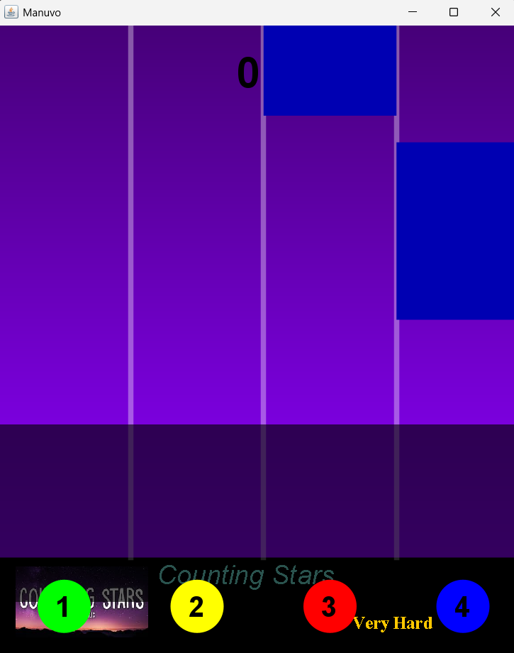

# Manuvo
It is a piano based game, where tiles come down and when you tap on them as music is streamed!
# Gameboard

# Introduction to game
The tiles come from top to bottom in four columns with the music playing in the background.
Tap the tiles as soon as they appear in the hit window at the bottom of the screen.
If you miss one tile the game is over!
There are currently five preset difficulty levels.
Each difficulty has a different song association.
The difficulty determines the speed of the tiles. 

# How to play
Use the UP and DOWN arrows to highlight a difficulty level/song.
Select the song with the ENTER key.
Tiles are in four columns labled `1,2,3,4`, these represents keys to press to hit the tile.
Press '1' to start the game.
A perfect hit is worth +3 points.
Early or late hit will give either +2 or +1 points.
Game ends when a tile is missed or the wrong number is pressed.
Press the ENTER key to return to the Main Screen. 

# Additional Information
Score is displayed in the top of the screen & buttons are displayed at the bottom of the screen.

# Developer Information
Progamming language: `Java'
Version: 'JDK-21'
